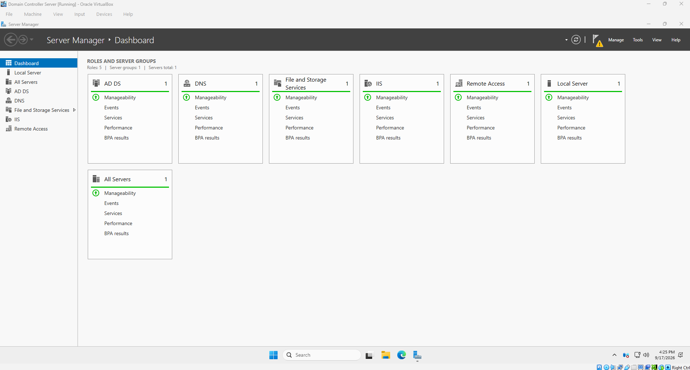
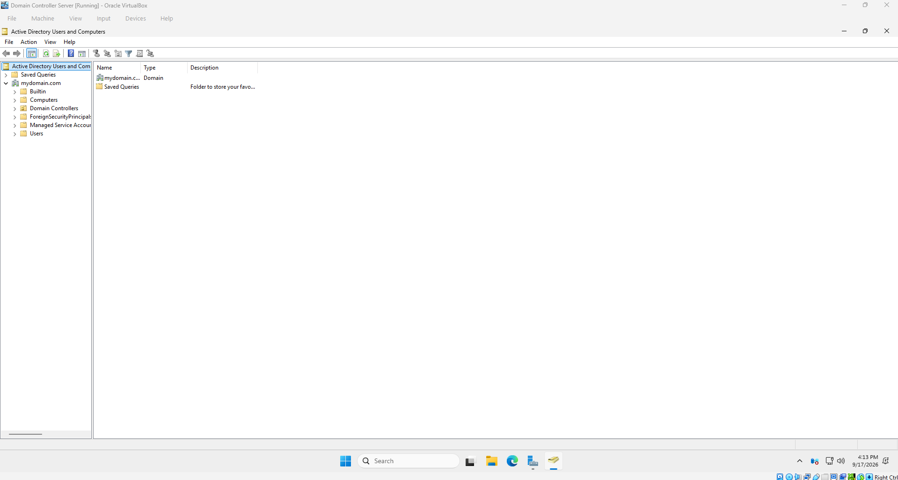
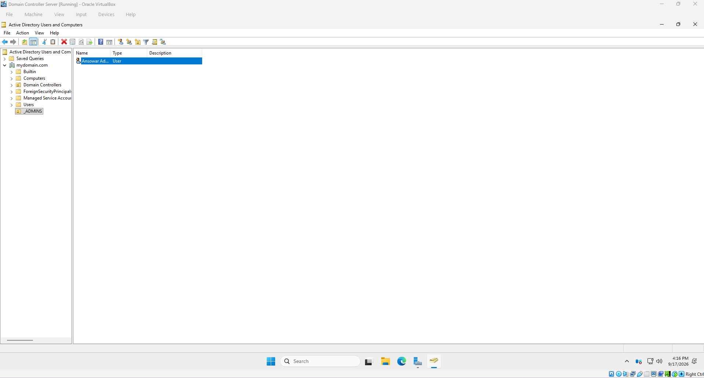
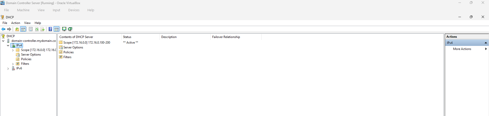
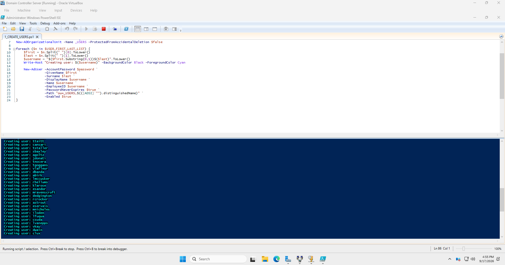
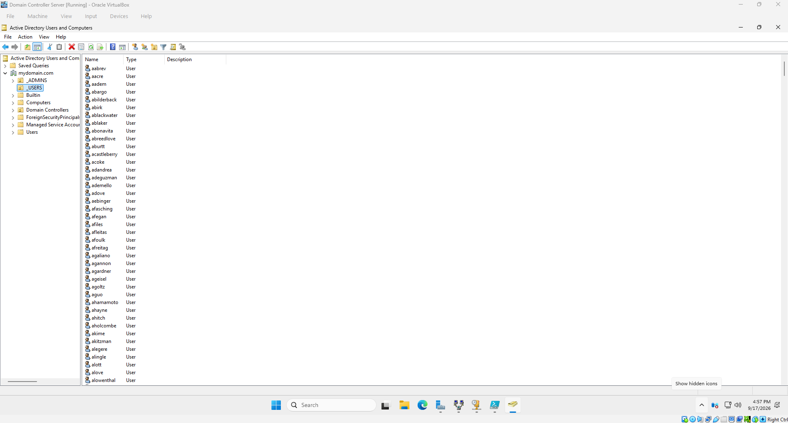
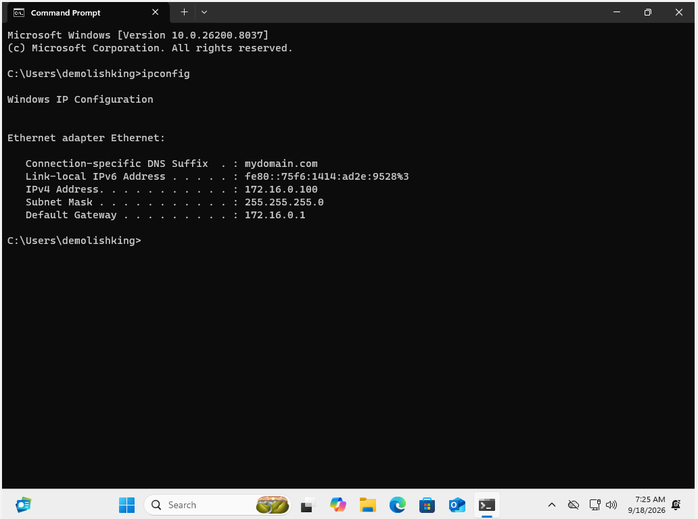
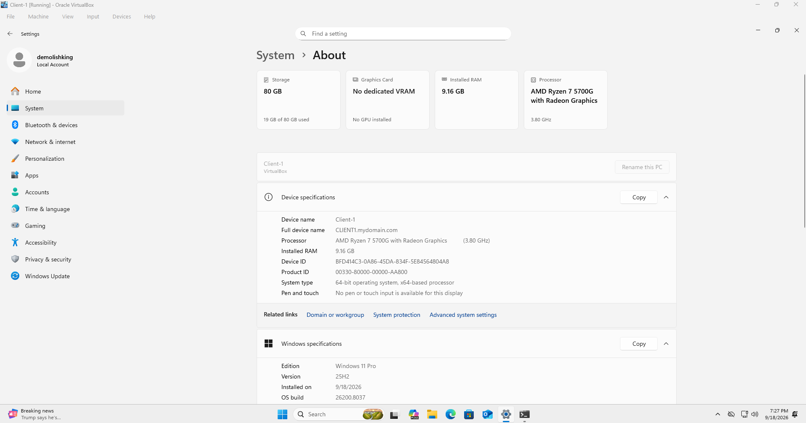
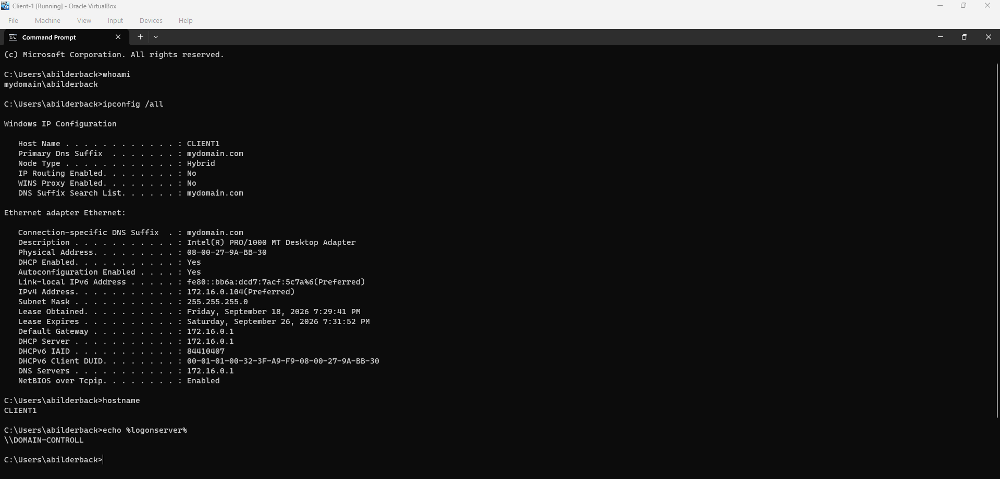

# 🏢 Active Directory Home Lab

## 📌 Project Overview

This project documents the step-by-step process I used to build and verify a Windows Active Directory home lab using Oracle VirtualBox.

The lab includes:

- Windows Server
- Active Directory Domain Services
- DNS
- DHCP
- Organizational Units
- Administrative accounts
- PowerShell automation
- Automated user creation
- Windows 11 domain joining
- Domain authentication
- Client network verification

---

# 🖥️ Step 1 - Verify Windows Server Roles

I started by checking the Windows Server environment and verifying that the important server roles were installed.

The Server Manager dashboard showed services including:

- Active Directory Domain Services
- DNS
- File and Storage Services
- IIS
- Remote Access

## ✅ Verification



### What This Proves

- Windows Server was running correctly
- Active Directory Domain Services was installed
- DNS was installed
- Additional server roles were successfully configured

---

# 🌐 Step 2 - Create the Active Directory Domain

I promoted the Windows Server machine to a domain controller and created a new Active Directory domain.

The domain used in the lab was:

```text
mydomain.com
```

After the server was promoted to a domain controller, I opened **Active Directory Users and Computers** to verify that the domain was created successfully.

## ✅ Verification



### What This Proves

- The Active Directory domain was created
- The server was functioning as a domain controller
- `mydomain.com` was available in Active Directory Users and Computers

---

# 👤 Step 3 - Create an Administrative Organizational Unit

I created a dedicated Organizational Unit for administrative accounts.

The OU was named:

```text
_ADMINS
```

I then created an administrative account inside the `_ADMINS` Organizational Unit.

## ✅ Verification



### What This Proves

- The `_ADMINS` Organizational Unit was created
- An administrative account was added
- Active Directory objects were organized into separate containers

---

# 📡 Step 4 - Configure DHCP

I configured DHCP on the domain controller so client computers could automatically receive network settings.

The DHCP scope was configured for the following IP address range:

```text
172.16.0.100 - 172.16.0.200
```

The scope was activated after configuration.

## ✅ Verification



### What This Proves

- The DHCP service was configured
- The IPv4 scope was active
- The server was ready to assign IP addresses to client machines

---

# ⚡ Step 5 - Automate User Creation with PowerShell

Instead of creating users manually one at a time, I used PowerShell to automate the process.

The script created Active Directory user accounts and placed them inside a dedicated Users Organizational Unit.

The script used Active Directory PowerShell commands such as:

```powershell
New-ADOrganizationalUnit
New-ADUser
```

## ✅ Verification



### What This Proves

- PowerShell was used to automate Active Directory administration
- User accounts were being created automatically
- Repetitive administrative work could be completed more efficiently

---

# 👥 Step 6 - Verify the Users Were Created

After the PowerShell script completed, I opened **Active Directory Users and Computers** to verify that the accounts were created successfully.

A dedicated Organizational Unit named:

```text
_USERS
```

contained the newly created user accounts.

## ✅ Verification



### What This Proves

- The PowerShell script successfully created users
- The accounts appeared inside Active Directory
- The users were placed inside the correct Organizational Unit

---

# 🌍 Step 7 - Verify Client Network Configuration

After creating the Windows client machine, I checked its network configuration.

I ran:

```cmd
ipconfig
```

The client received:

```text
IPv4 Address: 172.16.0.100
Subnet Mask: 255.255.255.0
Default Gateway: 172.16.0.1
DNS Suffix: mydomain.com
```

## ✅ Verification



### What This Proves

- DHCP was working
- The client received an IP address automatically
- The client was connected to the correct internal network
- The client received the domain DNS suffix

---

# 💻 Step 8 - Join Windows 11 to the Domain

I joined the Windows 11 Pro client machine to the Active Directory domain.

The full device name showed:

```text
CLIENT1.mydomain.com
```

## ✅ Verification



### What This Proves

- The Windows 11 client successfully joined the domain
- The client could locate the Active Directory domain
- DNS was functioning correctly
- The workstation became part of the domain environment

---

# 🔎 Step 9 - Verify Domain Authentication and Connectivity

After joining the client to the domain, I logged into Windows using a domain account.

I then ran several commands to verify that the environment was functioning correctly.

## Verify Logged-In User

I ran:

```cmd
whoami
```

The output showed:

```text
mydomain\abilderback
```

This confirmed that the user was authenticated through Active Directory.

---

## Verify Network Configuration

I ran:

```cmd
ipconfig /all
```

Important values included:

```text
DHCP Enabled: Yes
DHCP Server: 172.16.0.1
DNS Server: 172.16.0.1
DNS Suffix: mydomain.com
```

---

## Verify Hostname

I ran:

```cmd
hostname
```

The output showed:

```text
CLIENT1
```

---

## Verify Logon Server

I ran:

```cmd
echo %logonserver%
```

The output showed the domain controller being used to authenticate the user.

## ✅ Final Verification



### What This Proves

- The client was joined to the domain
- A domain user successfully authenticated
- DHCP was working
- DNS was working
- The hostname was correct
- The client was communicating with the domain controller
- Active Directory authentication was functioning

---

# 🏗️ Final Lab Environment

The completed environment looked like this:

```text
Windows Server Domain Controller
│
├── Active Directory Domain Services
├── DNS
├── DHCP
├── Administrative OU
├── Users OU
└── PowerShell User Automation
        │
        │
        ▼
Windows 11 Client
│
├── Joined to mydomain.com
├── Received DHCP Address
├── Used Domain DNS
├── Logged in with Domain Account
└── Verified Domain Controller Communication
```

---

# 🧠 Skills Practiced

This lab gave me hands-on experience with:

- Windows Server administration
- Active Directory Domain Services
- Domain controller deployment
- Active Directory domain creation
- Organizational Units
- Administrative account management
- DNS
- DHCP
- PowerShell automation
- Automated user provisioning
- Windows 11 domain joining
- Domain authentication
- TCP/IP networking
- Client verification
- Troubleshooting
- Virtual machine administration

---

# 📚 What I Learned

This lab helped me understand how a Windows domain environment works from both the server and client side.

I gained hands-on experience with:

- Creating an Active Directory domain
- Managing users and Organizational Units
- Automating user creation with PowerShell
- Configuring DHCP
- Working with DNS
- Joining a Windows workstation to a domain
- Logging in with domain credentials
- Verifying authentication
- Verifying client network connectivity
- Troubleshooting Windows domain communication

---

# 🔐 Security Considerations

This environment was created as a home lab for educational purposes.

In a production environment, additional security controls would be needed, including:

- Strong password policies
- Account lockout policies
- Least privilege
- Group Policy Objects
- Security auditing
- Windows Firewall configuration
- PowerShell logging
- Centralized logging
- Endpoint monitoring
- Multi-factor authentication

---

# 🚀 Future Improvements

I plan to continue expanding this lab with additional Windows administration and cybersecurity projects.

Future improvements may include:

- Group Policy Objects
- Password policies
- Account lockout policies
- Security groups
- Shared folders
- NTFS permissions
- Windows Event Logging
- Sysmon
- Wazuh integration
- Splunk integration
- Active Directory security testing
- Windows Server hardening
- Centralized logging
- PowerShell logging

---

# 📸 Screenshot Summary

| Screenshot | Description |
|---|---|
| `04-server-roles.png` | Windows Server roles installed |
| `05-domain-created.png` | Active Directory domain created |
| `06-admin-ou-user.png` | Administrative OU and account |
| `08-dhcp-scope.png` | Active DHCP scope |
| `09-powershell-user-creation.png` | PowerShell automated user creation |
| `10-active-directory-users.png` | Created Active Directory users |
| `11-client-dhcp-ip.png` | Client DHCP configuration |
| `12-domain-joined-client.png` | Windows client joined to the domain |
| `14-final-domain-verification.png` | Final authentication and network verification |

---

# 📖 Acknowledgment

This lab was completed as a hands-on learning project while following an Active Directory home lab tutorial.

The environment was personally configured, tested, verified, and documented as part of my Windows administration and cybersecurity practice.
